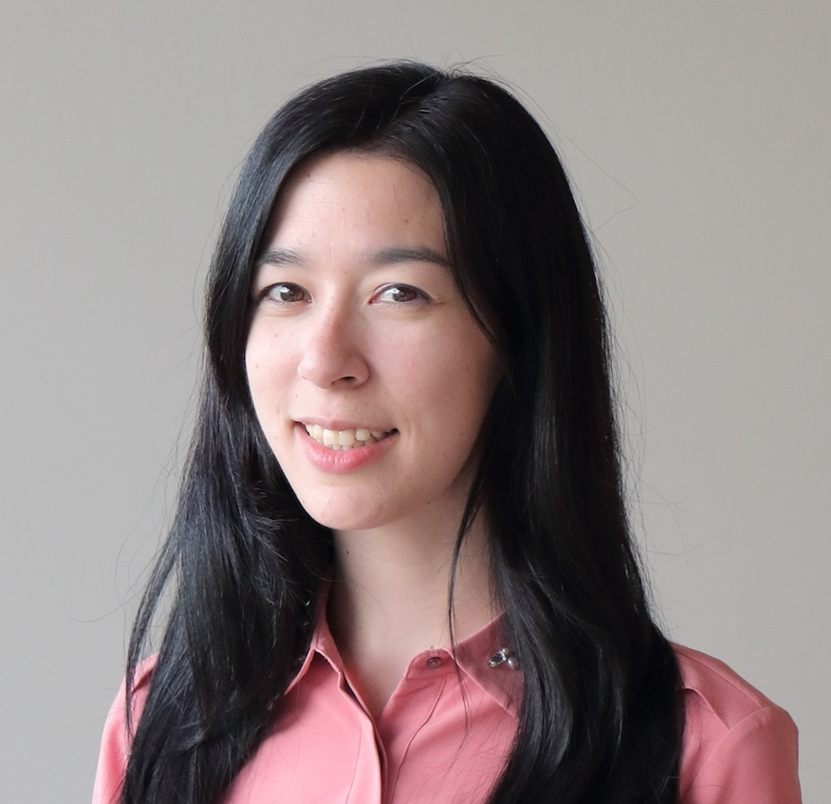

Hi there,

I am a clinical genetics and genomics trainee at the University of British Columbia (Vancouver, Canada) and I am currently pursuing my M.Sc Bioinformatics degree in the field of genomics, hereditary cancer syndromes and clinical bioinformatics. I am currently a graduate student of [Steven J.M. Jones' Lab](http://www.bcgsc.ca/faculty/sjones) at the Canada's Michael Smith Genome Sciences Center and of [Kasmintan A. Schrader's Lab](http://molonc.bccrc.ca/schrader-lab/) at the BC Cancer Research Centre.  

For more details you can [Click Here to download my CV ](https://github.com/mylinhthibodeau/CurriculumVitae/blob/master/CCV-My_LinhThibodeau-CIHR_Academic.pdf)
